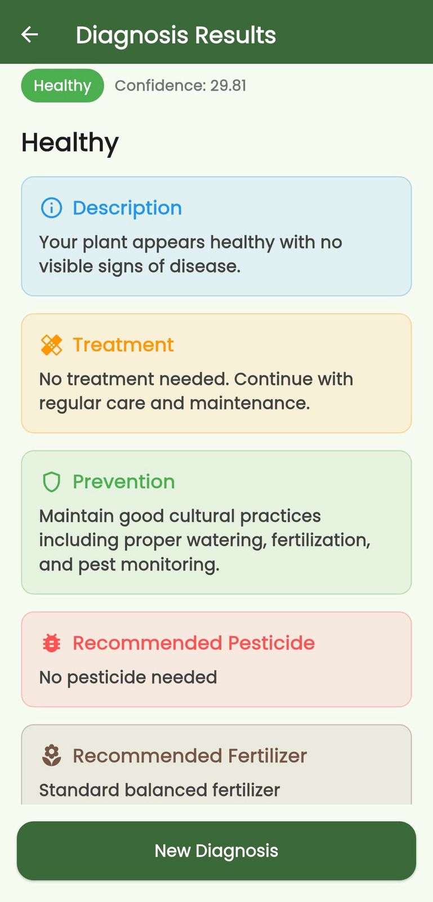
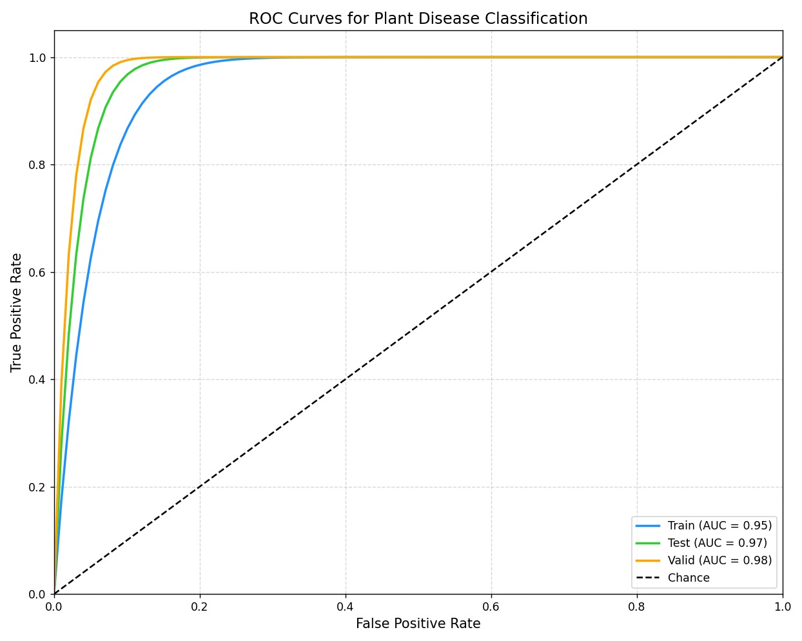
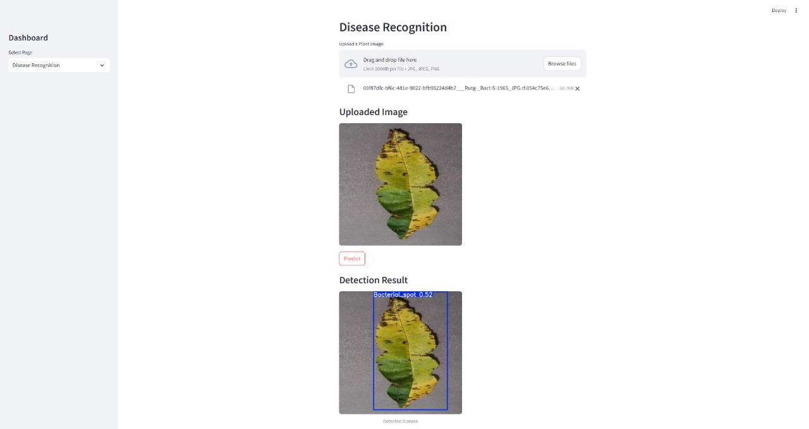
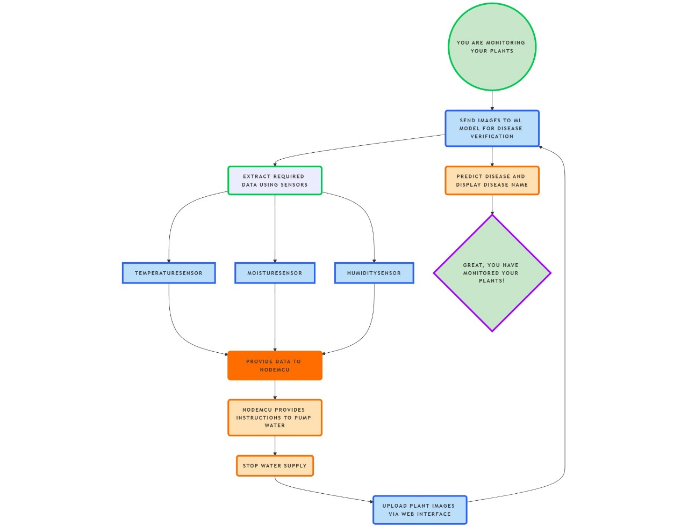
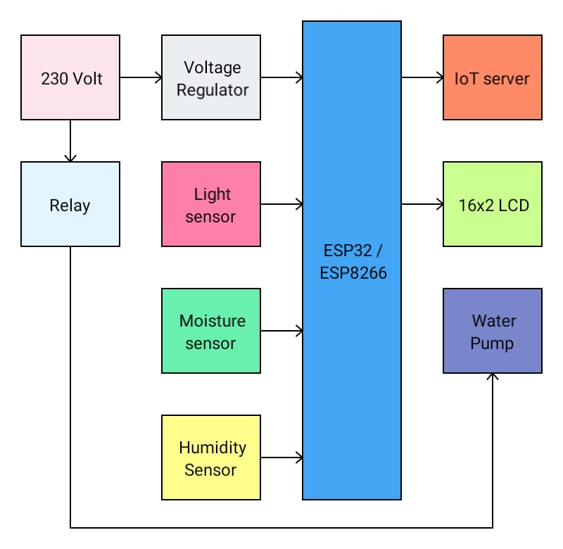
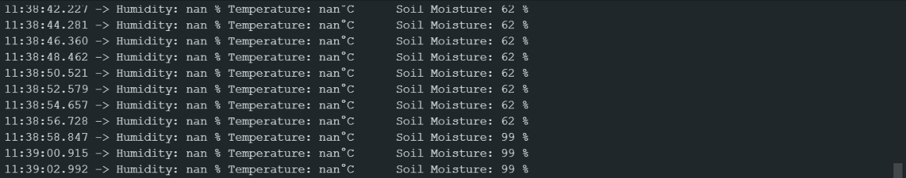

# 🌿 Crop Health Assessment and Disease Detection via
 Attention-Mechanism and Smart Sensing in Precision
 Farming

An end-to-end IoT + ML system to detect plant diseases using deep learning, advise fertilizer/pesticide, and enable real-time monitoring via mobile app and ESP32-CAM integration.

##  Features

-  Leaf disease detection using YOLOv5 + Selective Feature Refinement (SFR)
-  Flutter mobile app with upload/camera + advisory UI
-  ESP32-CAM for field-based image capture and inference
-  Flask REST API to handle predictions
-  Advisory for fertilizer, pesticide, and precautions
-  Soil/humidity sensor integration for irrigation management

---

##  Tech Stack

| Layer            | Tech Used |
|------------------|-----------|
| ML Model         | YOLOv5 + SFR (PyTorch) |
| Backend API      | Flask (Python) |
| Mobile App       | Flutter |
| IoT Devices      | ESP32-CAM, NodeMCU, DHT11, Moisture Sensor, Relay |
| Advisory DB      | JSON / Firebase Realtime DB |
| Hosting          | Render/Railway|

---

##  Project Folder Structure

```
📦 agrodoc-smart-plant-disease-detection/
├── ML_Model/
│   ├── detect.py
│   ├── train.py
│   ├── model_weights.pt
│   └── requirements.txt
├── Backend_Flask/
│   ├── app.py
│   ├── utils/
│   │   └── inference.py
│   └── static/
│       └── uploads/
├── IoT_ESP32_CAM/
│   ├── esp32_cam_capture.ino
│   └── http_post_image.ino
├── Flutter_App/
│   ├── lib/
│   │   ├── main.dart
│   │   └── screens/
│   │       ├── home.dart
│   │       ├── result.dart
│   │       └── upload.dart
│   └── pubspec.yaml
├── Advisory_DB/
│   └── advisory.json
├── Website_Interface/
│   ├── index.html
│   ├── style.css
│   └── script.js
├── .gitignore
├── README.md
└── LICENSE
```

---

##  Workflow

1. User uploads plant image via **Flutter app** or **ESP32-CAM**.
2. Flask backend receives image → processes it with **YOLOv5 + SFR**.
3. Detected disease is matched with **advisory.json**.
4. JSON response sent with:
    -  Disease Name
    -  Recommended Fertilizer
    -  Pesticide
    -  Precautions

---

##  Flutter App UI

- Camera and gallery upload
- Show detection result + advisory
- Optional history log (Firebase)
- Beautiful Material3 design

---

##  ESP32-CAM Role

- Capture image
- Convert to base64
- POST to Flask backend
- View response on OLED / Serial Monitor

---


## Outputs

### 📱 App UI Screens


---

### 📊 Graphs & Visualizations




---

### 💻 Web Interface Snapshots



---

### 🤖 Model Results & ML Flow




---

### 📚 Additional Illustrations





---


##  Sample API Response

```json
{
  "disease": "Tomato Leaf Curl",
  "fertilizer": "NPK 20-20-20",
  "pesticide": "Imidacloprid",
  "precautions": "Remove infected leaves, control whitefly population"
}
```

## Request Full Source Access

This repository provides a detailed overview of the project architecture and components.  
To maintain project integrity and control distribution, the complete implementation (including trained models, mobile app builds, firmware, and extended documentation) is available **upon request**.

 **To request access:**  
Feel free to contact me via:

-  **Email:** [medaramvishnu7@gmail.com]  

> Access is granted for academic review, demonstration, or collaboration purposes only.
